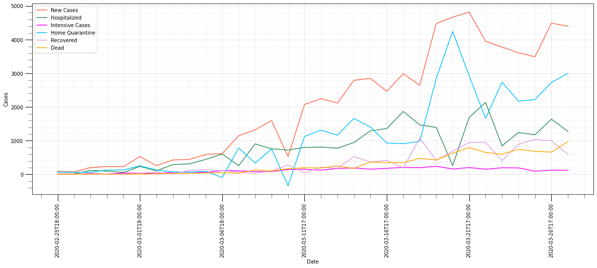
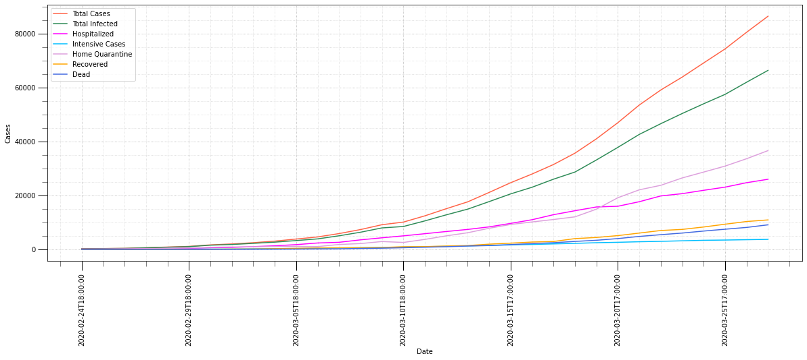
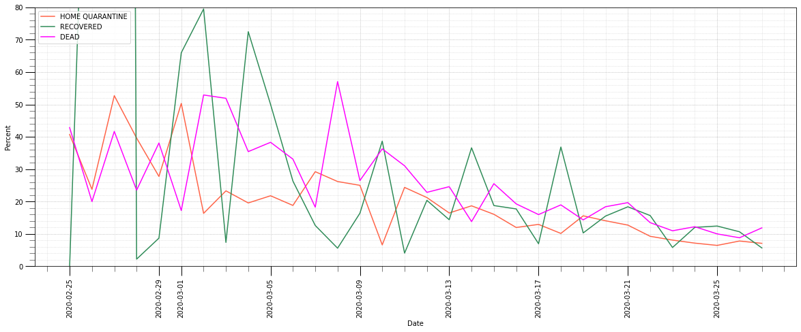
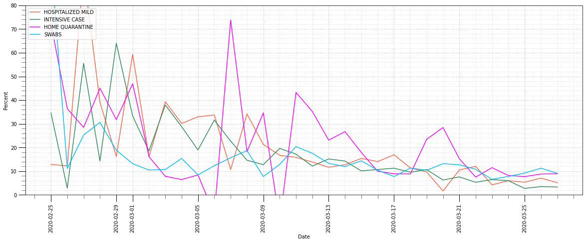
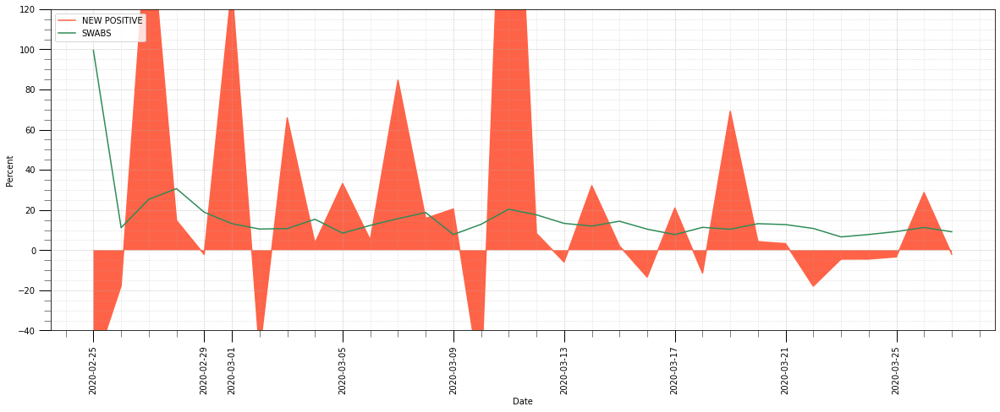
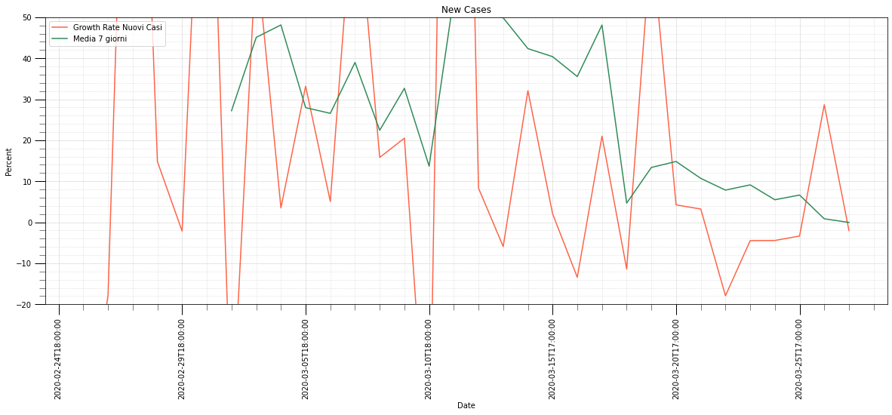
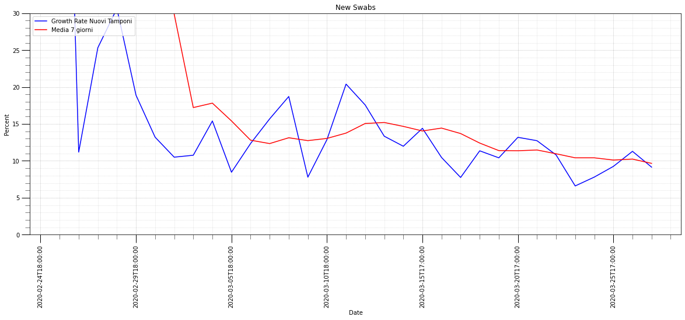
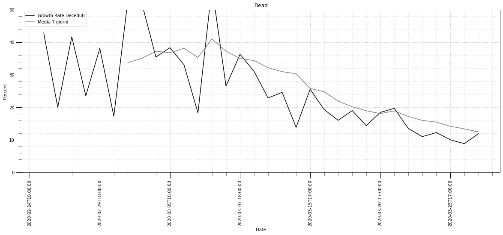
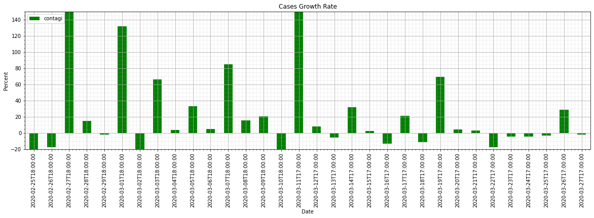

# Covid-19 Analysis

Analisi della situazione italiana del Covid-19 basata sui dati della Protezione Civile. I dati sono aggiornati alle 18.30 e sono recuperati dal repository https://github.com/pcm-dpc/COVID-19. Per aggiornare i dati rilanciare il presente Notebook.

Questo Report è stato sviluppando usando Jupyter Lab un tool che permette la scrittura di codice Python tramite Browser. 
Il codice sorgente è disponibile all'indirizzo https://github.com/pasalino/Covid-19-PyAnalysis .

Sono gradite le Star (stelline in alto a destra della pagina).
Sono graditi commenti e suggerimenti che potete inviare all'indirizzo pasalino@gmail.com oppure sulla pagina https://github.com/pasalino/Covid-19-PyAnalysis/issues .

**Disclosure e scarico di responsabilità**

Questo report non vuole sostituirsi alle fonti ufficiali, ma ne va a completamento. Non consideratelo una fonte ufficiale ma una lettura dei dati ufficiali da un punto di vista matematico.
Non mi ritengo responsabile della diffusione di questo report se non nei limiti delal condivisione di pensiero atta a comprendere meglio i dati. I dati in questo report, non sono analizzati da esperti di settore e quindi proni ad errori.
Potrebbero esserci errori e inesattezze nel codice che produce i dati. Attraverso la pagina sopra indicata è possibile indicarle.

    ### AGGIORNAMENTO DATI ###
    ### AGGIORNAMENTO TERMINATO ###

    ### ULTIMO AGGIORNAMENTO  DATI PROTEZIONE CIVILE ###
    Fri Mar 27 18:26:47 2020 +0100

## Dati Nazionali

**I dati totali di oggi:**

<table border="1" class="dataframe">
  <thead>
    <tr style="text-align: right;">
      <th></th>
      <th>DATA</th>
      <th>RICOVERATI LIEVI</th>
      <th>TERAPIA INTENSIVA</th>
      <th>TOT. RICOVERATI</th>
      <th>ISOLAMENTO DOMICILIARE</th>
      <th>TOTALI POSITIVI</th>
      <th>NUOVI CASI</th>
      <th>GUARITI</th>
      <th>DECEDUTI</th>
      <th>CASI TOTALI</th>
      <th>TAMPONI</th>
    </tr>
    <tr>
      <th></th>
      <th></th>
      <th></th>
      <th></th>
      <th></th>
      <th></th>
      <th></th>
      <th></th>
      <th></th>
      <th></th>
      <th></th>
      <th></th>
    </tr>
  </thead>
  <tbody>
    <tr>
      <th>27-03-20</th>
      <td>2020-03-27T17:00:00</td>
      <td>26029</td>
      <td>3732</td>
      <td>29761</td>
      <td>36653</td>
      <td>66414</td>
      <td>4401</td>
      <td>10950</td>
      <td>9134</td>
      <td>86498</td>
      <td>394079</td>
    </tr>
  </tbody>
</table>

ddddddd

### Daily incremental data

eeeeee

ffff

<table border="1" class="dataframe">
  <thead>
    <tr style="text-align: right;">
      <th></th>
      <th>DATA</th>
      <th>RICOVERATI LIEVI</th>
      <th>TERAPIA INTENSIVA</th>
      <th>TOT. RICOVERATI</th>
      <th>ISOLAMENTO DOMICILIARE</th>
      <th>TOTALI POSITIVI</th>
      <th>NUOVI CASI</th>
      <th>GUARITI</th>
      <th>DECEDUTI</th>
      <th>CASI TOTALI</th>
      <th>TAMPONI</th>
    </tr>
    <tr>
      <th></th>
      <th></th>
      <th></th>
      <th></th>
      <th></th>
      <th></th>
      <th></th>
      <th></th>
      <th></th>
      <th></th>
      <th></th>
      <th></th>
    </tr>
  </thead>
  <tbody>
    <tr>
      <th>27-03-20</th>
      <td>2020-03-27T17:00:00</td>
      <td>1276</td>
      <td>120</td>
      <td>1396</td>
      <td>3005</td>
      <td>4401</td>
      <td>4401</td>
      <td>589</td>
      <td>969</td>
      <td>5959</td>
      <td>33019</td>
    </tr>
  </tbody>
</table>

**Last 5 days:**

<table border="1" class="dataframe">
  <thead>
    <tr style="text-align: right;">
      <th></th>
      <th>DATA</th>
      <th>RICOVERATI LIEVI</th>
      <th>TERAPIA INTENSIVA</th>
      <th>TOT. RICOVERATI</th>
      <th>ISOLAMENTO DOMICILIARE</th>
      <th>TOTALI POSITIVI</th>
      <th>NUOVI CASI</th>
      <th>GUARITI</th>
      <th>DECEDUTI</th>
      <th>CASI TOTALI</th>
      <th>TAMPONI</th>
    </tr>
    <tr>
      <th></th>
      <th></th>
      <th></th>
      <th></th>
      <th></th>
      <th></th>
      <th></th>
      <th></th>
      <th></th>
      <th></th>
      <th></th>
      <th></th>
    </tr>
  </thead>
  <tbody>
    <tr>
      <th>23-03-20</th>
      <td>2020-03-23T17:00:00</td>
      <td>846</td>
      <td>195</td>
      <td>1041</td>
      <td>2739</td>
      <td>3780</td>
      <td>3780</td>
      <td>408</td>
      <td>601</td>
      <td>4789</td>
      <td>17066</td>
    </tr>
    <tr>
      <th>24-03-20</th>
      <td>2020-03-24T17:00:00</td>
      <td>1245</td>
      <td>192</td>
      <td>1437</td>
      <td>2175</td>
      <td>3612</td>
      <td>3612</td>
      <td>894</td>
      <td>743</td>
      <td>5249</td>
      <td>21496</td>
    </tr>
    <tr>
      <th>25-03-20</th>
      <td>2020-03-25T17:00:00</td>
      <td>1175</td>
      <td>93</td>
      <td>1268</td>
      <td>2223</td>
      <td>3491</td>
      <td>3491</td>
      <td>1036</td>
      <td>683</td>
      <td>5210</td>
      <td>27481</td>
    </tr>
    <tr>
      <th>26-03-20</th>
      <td>2020-03-26T17:00:00</td>
      <td>1641</td>
      <td>123</td>
      <td>1764</td>
      <td>2728</td>
      <td>4492</td>
      <td>4492</td>
      <td>999</td>
      <td>662</td>
      <td>6153</td>
      <td>36615</td>
    </tr>
    <tr>
      <th>27-03-20</th>
      <td>2020-03-27T17:00:00</td>
      <td>1276</td>
      <td>120</td>
      <td>1396</td>
      <td>3005</td>
      <td>4401</td>
      <td>4401</td>
      <td>589</td>
      <td>969</td>
      <td>5959</td>
      <td>33019</td>
    </tr>
  </tbody>
</table>

### Trend

**Last 5 days:**

<table border="1" class="dataframe">
  <thead>
    <tr style="text-align: right;">
      <th></th>
      <th>DATA</th>
      <th>RICOVERATI LIEVI</th>
      <th>TERAPIA INTENSIVA</th>
      <th>TOT. RICOVERATI</th>
      <th>ISOLAMENTO DOMICILIARE</th>
      <th>TOTALI POSITIVI</th>
      <th>NUOVI CASI</th>
      <th>GUARITI</th>
      <th>DECEDUTI</th>
      <th>CASI TOTALI</th>
      <th>TAMPONI</th>
    </tr>
    <tr>
      <th></th>
      <th></th>
      <th></th>
      <th></th>
      <th></th>
      <th></th>
      <th></th>
      <th></th>
      <th></th>
      <th></th>
      <th></th>
      <th></th>
    </tr>
  </thead>
  <tbody>
    <tr>
      <th>23-03-20</th>
      <td>2020-03-23T17:00:00</td>
      <td>20692</td>
      <td>3204</td>
      <td>23896</td>
      <td>26522</td>
      <td>50418</td>
      <td>3780</td>
      <td>7432</td>
      <td>6077</td>
      <td>63927</td>
      <td>275468</td>
    </tr>
    <tr>
      <th>24-03-20</th>
      <td>2020-03-24T17:00:00</td>
      <td>21937</td>
      <td>3396</td>
      <td>25333</td>
      <td>28697</td>
      <td>54030</td>
      <td>3612</td>
      <td>8326</td>
      <td>6820</td>
      <td>69176</td>
      <td>296964</td>
    </tr>
    <tr>
      <th>25-03-20</th>
      <td>2020-03-25T17:00:00</td>
      <td>23112</td>
      <td>3489</td>
      <td>26601</td>
      <td>30920</td>
      <td>57521</td>
      <td>3491</td>
      <td>9362</td>
      <td>7503</td>
      <td>74386</td>
      <td>324445</td>
    </tr>
    <tr>
      <th>26-03-20</th>
      <td>2020-03-26T17:00:00</td>
      <td>24753</td>
      <td>3612</td>
      <td>28365</td>
      <td>33648</td>
      <td>62013</td>
      <td>4492</td>
      <td>10361</td>
      <td>8165</td>
      <td>80539</td>
      <td>361060</td>
    </tr>
    <tr>
      <th>27-03-20</th>
      <td>2020-03-27T17:00:00</td>
      <td>26029</td>
      <td>3732</td>
      <td>29761</td>
      <td>36653</td>
      <td>66414</td>
      <td>4401</td>
      <td>10950</td>
      <td>9134</td>
      <td>86498</td>
      <td>394079</td>
    </tr>
  </tbody>
</table>

### Growth rate (%)

**Last 5 days**

<table border="1" class="dataframe">
  <thead>
    <tr style="text-align: right;">
      <th></th>
      <th>DATA</th>
      <th>NUOVI CASI</th>
      <th>TOTALI POSITIVI</th>
      <th>RICOVERATI LIEVI</th>
      <th>TERAPIA INTENSIVA</th>
      <th>ISOLAMENTO DOMICILIARE</th>
      <th>GUARITI</th>
      <th>DECEDUTI</th>
      <th>TAMPONI</th>
    </tr>
    <tr>
      <th></th>
      <th></th>
      <th></th>
      <th></th>
      <th></th>
      <th></th>
      <th></th>
      <th></th>
      <th></th>
      <th></th>
    </tr>
  </thead>
  <tbody>
    <tr>
      <th>23-03-20</th>
      <td>2020-03-23</td>
      <td>-4.47</td>
      <td>8.10</td>
      <td>4.26</td>
      <td>6.48</td>
      <td>11.52</td>
      <td>5.81</td>
      <td>10.98</td>
      <td>6.60</td>
    </tr>
    <tr>
      <th>24-03-20</th>
      <td>2020-03-24</td>
      <td>-4.44</td>
      <td>7.16</td>
      <td>6.02</td>
      <td>5.99</td>
      <td>8.20</td>
      <td>12.03</td>
      <td>12.23</td>
      <td>7.80</td>
    </tr>
    <tr>
      <th>25-03-20</th>
      <td>2020-03-25</td>
      <td>-3.35</td>
      <td>6.46</td>
      <td>5.36</td>
      <td>2.74</td>
      <td>7.75</td>
      <td>12.44</td>
      <td>10.01</td>
      <td>9.25</td>
    </tr>
    <tr>
      <th>26-03-20</th>
      <td>2020-03-26</td>
      <td>28.67</td>
      <td>7.81</td>
      <td>7.10</td>
      <td>3.53</td>
      <td>8.82</td>
      <td>10.67</td>
      <td>8.82</td>
      <td>11.29</td>
    </tr>
    <tr>
      <th>27-03-20</th>
      <td>2020-03-27</td>
      <td>-2.03</td>
      <td>7.10</td>
      <td>5.15</td>
      <td>3.32</td>
      <td>8.93</td>
      <td>5.68</td>
      <td>11.87</td>
      <td>9.15</td>
    </tr>
  </tbody>
</table>

## Trends and average

<table border="1" class="dataframe">
  <thead>
    <tr style="text-align: right;">
      <th></th>
      <th>data</th>
      <th>nuovi_attualmente_positivi_casi</th>
      <th>nuovi_attualmente_positivi_percent</th>
      <th>avg_nuovi</th>
      <th>tamponi</th>
      <th>tamponi_percent</th>
      <th>avg_tamponi</th>
      <th>deceduti</th>
      <th>deceduti_percent</th>
      <th>avg_deceduti</th>
    </tr>
    <tr>
      <th></th>
      <th></th>
      <th></th>
      <th></th>
      <th></th>
      <th></th>
      <th></th>
      <th></th>
      <th></th>
      <th></th>
      <th></th>
    </tr>
  </thead>
  <tbody>
    <tr>
      <th>21-03-20</th>
      <td>2020-03-21T17:00:00</td>
      <td>4821</td>
      <td>3.23</td>
      <td>10.70</td>
      <td>26336</td>
      <td>12.73</td>
      <td>11.47</td>
      <td>793</td>
      <td>19.67</td>
      <td>18.89</td>
    </tr>
    <tr>
      <th>22-03-20</th>
      <td>2020-03-22T17:00:00</td>
      <td>3957</td>
      <td>-17.92</td>
      <td>7.84</td>
      <td>25180</td>
      <td>10.80</td>
      <td>10.96</td>
      <td>651</td>
      <td>13.49</td>
      <td>17.17</td>
    </tr>
    <tr>
      <th>23-03-20</th>
      <td>2020-03-23T17:00:00</td>
      <td>3780</td>
      <td>-4.47</td>
      <td>9.12</td>
      <td>17066</td>
      <td>6.60</td>
      <td>10.41</td>
      <td>601</td>
      <td>10.98</td>
      <td>15.98</td>
    </tr>
    <tr>
      <th>24-03-20</th>
      <td>2020-03-24T17:00:00</td>
      <td>3612</td>
      <td>-4.44</td>
      <td>5.49</td>
      <td>21496</td>
      <td>7.80</td>
      <td>10.41</td>
      <td>743</td>
      <td>12.23</td>
      <td>15.44</td>
    </tr>
    <tr>
      <th>25-03-20</th>
      <td>2020-03-25T17:00:00</td>
      <td>3491</td>
      <td>-3.35</td>
      <td>6.64</td>
      <td>27481</td>
      <td>9.25</td>
      <td>10.11</td>
      <td>683</td>
      <td>10.01</td>
      <td>14.16</td>
    </tr>
    <tr>
      <th>26-03-20</th>
      <td>2020-03-26T17:00:00</td>
      <td>4492</td>
      <td>28.67</td>
      <td>0.85</td>
      <td>36615</td>
      <td>11.29</td>
      <td>10.24</td>
      <td>662</td>
      <td>8.82</td>
      <td>13.37</td>
    </tr>
    <tr>
      <th>27-03-20</th>
      <td>2020-03-27T17:00:00</td>
      <td>4401</td>
      <td>-2.03</td>
      <td>-0.04</td>
      <td>33019</td>
      <td>9.15</td>
      <td>9.66</td>
      <td>969</td>
      <td>11.87</td>
      <td>12.44</td>
    </tr>
  </tbody>
</table>

## PERCENTUALI

<table border="1" class="dataframe">
  <thead>
    <tr style="text-align: right;">
      <th></th>
      <th>data</th>
      <th>ricoverati_con_sintomi</th>
      <th>terapia_intensiva</th>
      <th>totale_ospedalizzati</th>
      <th>isolamento_domiciliare</th>
      <th>totale_attualmente_positivi</th>
      <th>nuovi_attualmente_positivi</th>
      <th>dimessi_guariti</th>
      <th>deceduti</th>
      <th>totale_casi</th>
      <th>tamponi</th>
    </tr>
    <tr>
      <th></th>
      <th></th>
      <th></th>
      <th></th>
      <th></th>
      <th></th>
      <th></th>
      <th></th>
      <th></th>
      <th></th>
      <th></th>
      <th></th>
    </tr>
  </thead>
  <tbody>
    <tr>
      <th>27-03-20</th>
      <td>2020-03-27T17:00:00</td>
      <td>26029</td>
      <td>3732</td>
      <td>29761</td>
      <td>36653</td>
      <td>66414</td>
      <td>4401</td>
      <td>10950</td>
      <td>9134</td>
      <td>86498</td>
      <td>394079</td>
    </tr>
  </tbody>
</table>

# DATI REGIONALI
